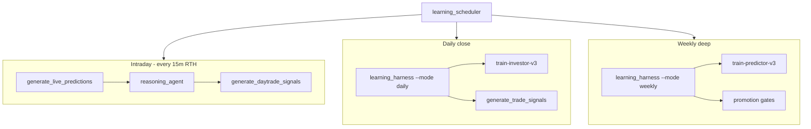

# Nostradamus Glorious Stack

Unified autonomous trading intelligence: dual ML brains, NPU acceleration, reasoning agent, and Robinhood fast paths.

## Architecture



## Quick start

```powershell
# 1) NPU stack (Snapdragon)
.\scripts\install_npu_stack.ps1 -GenAI

# 2) Continuous brain (market-aware)
.\scripts\continuous_brain.ps1

# 3) Local dashboard + APIs
python scripts/serve.py
```

## Cadence (profit-optimized)

| Phase | When | What gets smarter |
|-------|------|-------------------|
| **intraday_pulse** | Every 15m, 9:30–16:00 ET | Live predictions, reasoning journal, daytrade manifest |
| **daily_close** | Once after 16:15 ET | Investor policy, congress enrich, swing manifest |
| **weekly_deep** | Sunday | Full predictor retrain + champion/challenger for both ML stacks |

Tune via environment:

- `INTRADAY_PULSE_MINUTES=15`
- `DAILY_CLOSE_HOURS=22`
- `WEEKLY_DEEP_HOURS=168`
- `LIVE_PREDICT_LIMIT=800`

## Dual ML + promotion

- **Predictor v3**: 50 features (OHLCV + regime/congress/insider). Promoted via `promotion_gate_v3.py`.
- **Investor v3**: Policy regressor now trains on overlay features. Promoted via `promotion_gate_investor.py` (Sharpe + return composite).

## Reasoning agent (paper trading)

`scripts/reasoning_agent.py` maintains:

- `data/reasoning/strategy.json` — live strategy narrative
- `data/reasoning/journal.jsonl` — tick-by-tick reasoning log
- `data/reasoning/paper_portfolio.json` — simulated positions

Uses `npu_llm.py` (onnxruntime-genai on NPU when model present; structured template otherwise).

## Daytrading (Robinhood fast path)

- Manifest: `data/trading/daytrade_manifest.json`
- Signals: `data/trading/daytrade_signals.json`
- Policy: `config/daytrade_policy.json`

Poll `GET /api/daytrade/manifest` from Robinhood Agents for highest-turnover intraday orders.

## API endpoints

| Endpoint | Purpose |
|----------|---------|
| `GET /api/reasoning/strategy` | Current strategy + narrative |
| `GET /api/reasoning/journal` | Recent reasoning entries |
| `POST /api/reasoning/tick` | Force reasoning update |
| `GET /api/daytrade/manifest` | Intraday aggressive manifest |
| `GET /api/brain/schedule` | Scheduler state + next mode |
| `POST /api/brain/tick` | Run scheduler once |

## NPU notes

Run `python scripts/npu_runtime.py` to verify providers. Target order:

1. `QNNExecutionProvider` (Snapdragon)
2. `DmlExecutionProvider`
3. `CPUExecutionProvider`

For local LLM: place Phi-3 weights under `models/reasoning/` or set `NOSTRADAMUS_LLM_PATH`.
