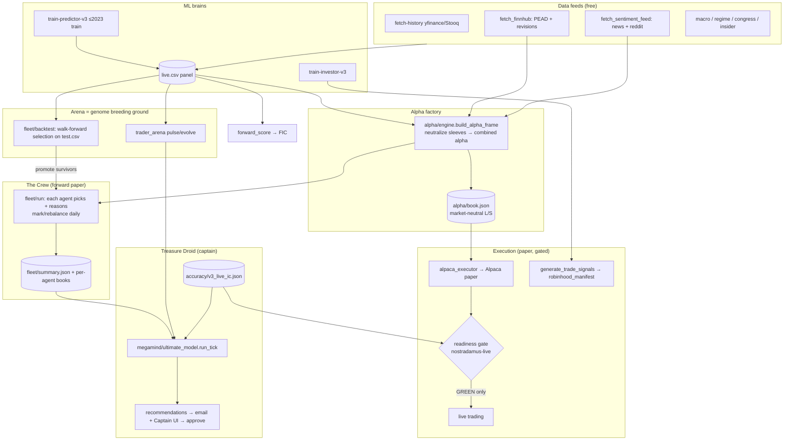

# Treasure Droid — System Handoff (read this first)

**Last updated:** 2026-06-06 · **Repo:** `C:\Users\nicho\Nostradamus_remote_audit` · **Public:** https://treasure-droid.com

> This is the single source of truth for the next context window. It captures what the
> system is, what works, what doesn't, how it all connects, and where to pick up.
> Companion docs: strategy in `ALPHA_DOCTRINE.md` + `UNGODLY.md`, the unification plan in
> `UNIFIED_ARCHITECTURE.md`, the live tracker in `MEGA_YACHT.md`, hosting in `HOSTING.md`,
> plain-English glossary in `SOUND_SMART.md`.

---

## 1. What it is

**Treasure Droid** is a personal, always-on autonomous trading-research system. A rusty
robot-pirate captain (the AI meta-agent) commands a **fleet of ML trading agents** that
hunt market "gold." The north star: become the decision engine for a Robinhood AI agent —
but **live capital is gated** behind proven forward edge.

**The thesis (Fundamental Law):** `Return ≈ IC × √Breadth × Transfer × Leverage × Compounding`.
We don't chase one genius model — we run many weak, uncorrelated **sleeves**, neutralized and
market-neutral, judged by **forward** performance, and let the captain allocate to what works.

---

## 2. Current state at a glance

| Subsystem | Status | Note |
|-----------|--------|------|
| Predictor v3 (next-day direction/return) | ✅ works | AUC ~0.54 — real but thin edge; weekly retrain |
| `live.csv` panel generation | ✅ works | fresh daily/intraday |
| Alpha engine (7 neutralized sleeves → market-neutral book) | ✅ works | blended spread +0.0003 on test (**upper bound**) |
| The Fleet (9 agents walking forward on paper + documented reasoning) | ✅ works | `#/fleet`; track record builds forward |
| Treasure Droid captain (recs + email + UI) | ✅ works | `#/megamind`; forward/fleet-aware recommendations |
| Sentiment feed (news + Reddit "gossip") | 🟡 partial | Finnhub news strong; **Reddit/crowd currently 0 (stale scrape)** |
| Historical walk-forward (genome selection) | ✅ works | honest train/holdout split; numbers are **upper bound** (see §4) |
| Forward IC scoring | 🟡 building | only ~1–2 live days; needs 20+ to clear gate |
| Per-sleeve forward IC + ICIR weights | ✅ works | `sleeve_ic.py`; Bridge table; auto-weights after 5 forward days |
| Mad Scientist Lab (8yr/2yr panel + walk-forward) | ✅ works | `historical/panel_builder.py` + `walkforward_lab.py`; 2.25M rows / 502 days |
| Alpaca paper execution | ✅ works | $100k paper, shorting on; daily rebalance |
| Hosting (tunnel + read-only-public guard) | ✅ works | treasure-droid.com, POST blocked from internet |
| UI (5 tabs, cockpit, starfield, optimized) | ✅ works | images 4.8MB→0.6MB |
| Auto-coder (approve → build) | 🟡 IDE handoff | local SDK broken on Win ARM64; cloud wired but off |
| **Live trading** | ⛔ blocked **by design** | readiness gate false (forward not proven) — correct |
| Forward paper P&L | 🔴 negative | ~−3% / Sharpe −1.x — the honest scoreboard; the work is to flip it |

**Mad Scientist one-liner:** the *machinery* experiments relentlessly on 8yr train + 2yr historical
walk-forward; the *alpha* is not yet proven **forward**. Capital stays gated until live paper screams yes.

---

## 3. Architecture map



**The captain loop (target & partly live):** MONITOR fleet forward scoreboard → SPAWN genomes
(arena + walk-forward) → SHADOW on paper → PROMOTE forward-proven → ALLOCATE → EXECUTE → repeat.

---

## 4. The scoreboards — which number is real

There are several P&L/score definitions; **only forward counts.**

| Scoreboard | Where | Trust |
|-----------|-------|-------|
| **Forward paper P&L** (Alpaca + nostradamus-live book) | Bridge, readiness | ✅ **THE truth** (currently negative) |
| **Forward rank IC** (`v3_live_ic.json`) | Bridge, captain | ✅ truth (only ~1–2 days so far) |
| Honest-eval tradeable IC/spread | nostradamus-live | 🟡 OOS backtest = upper bound |
| Alpha blended spread/ICIR (`alpha_ic.json`) | Bridge | 🟡 backtest on test window = upper bound |
| Walk-forward holdout Sharpe | Captain | 🟡 **upper bound** — correlated genomes on predictor's own test set |
| Arena sim cumulative %, investor v3 backtest | Arena, Investor | 🔴 sim/backtest — NOT proof |

**Walk-forward caveat (important):** the 600-genome run shows ~3 Sharpe / 45% holdout with 63/68
"surviving." This is NOT real edge — all genomes eat the same predictor signal on the predictor's
own test window (highly correlated), and selection→holdout drops from ~5.4 to ~1.1 Sharpe. It's a
candidate generator; the real test is the promoted survivors walking forward live in the Fleet.

---

## 5. Subsystem reference (concise)

- **Predictor v3** (`train-predictor-v3.py`): 50 features (25 OHLCV + 25 overlays), 5-seed stacked HGB + isotonic, next-day direction/return. Train ≤2023, val 2024, test 2025+. → `models/v3/predictor/`, `predictions_v3/{test,val}.csv`. Live inference: `generate_live_predictions.py` → `live.csv`.
- **Investor v3** (`train-investor-v3.py`): fractional-Kelly allocator on predictor outputs → `investor_v3/decisions.json`. Backtest negative; one sleeve among many now.
- **Alpha engine** (`intelligence/alpha/`): `build_alpha_frame()` = the shared **explainable signal frame** (per-symbol neutralized sleeve z-scores + combined alpha + price). 7 sleeves: ml_edge, reversal_1d, reversal_5d, momentum_120_20, pead, revisions, sentiment. `engine.run()` → market-neutral `book.json`. `measure.py` proves neutralization. `alpaca_executor.py` rebalances Alpaca paper.
- **The Crew / Fleet** (`intelligence/fleet/`): `run.py` steps every agent forward daily off the shared frame; `paper.py` = per-agent book (positions, trades.jsonl, equity, today.json) with `reasoning.py` documenting every pick (sleeve σ-contributions + ML proba/pred_ret + sizing). `registry.py` = crew roster. `backtest.py` = historical walk-forward (select 60% / judge holdout) + promote survivors.
- **Arena** (`intelligence/arena/`): genome breeding ground. v1/v2 **frozen** (pulse only); v3 champion evolves (harvest/evolve); challenger optional. Sim P&L from `pred_ret` — research only.
- **Treasure Droid captain** (`megamind.py` + `ultimate_model.py`): reads arena + fleet + forward IC, emits forward/fleet-aware recommendations (consumer-sentiment pipeline, re-weighted arena vX, adjust genomes, promote models, fleet allocation). Surfaced in daily **email** + `#/megamind`. Approve → IDE handoff (cloud auto-build wired behind `autoBuildMode=cloud`).
- **Sentiment** (`fetch_sentiment_feed.py`): Finnhub company-news → VADER + Reddit/crowd → per-symbol score → sentiment sleeve + dated history snapshots. (Finnhub social-sentiment is premium/403.)
- **Execution & gates**: investor picks → `robinhood_manifest.json`; alpha book → Alpaca paper. Live gated by `nostradamus-live/data/gate/readiness.json` (edge_proven + forward Sharpe + live IC + risk + no leakage). All currently red → paper only.
- **Hosting**: `treasure-droid.com` via named Cloudflare Tunnel → local port 4174. `serve.py` middleware blocks POST/mutations from the internet (read-only public). See `HOSTING.md`.

---

## 6. Autonomous cadence

- **`autonomous_loop.ps1`** (always-on supervisor): reasoning 15m, intraday harness 4h, penny 2h, penny-ml continuous, intelligence 2h, arena 1h, improve 6h, megamind-agent 5m, tunnel (if enabled).
- **`daily_market_close.ps1`** (post-close, ~5pm ET via nostradamus-live `daily_update.ps1`): history → live preds → finnhub → sentiment → alpha engine → **fleet** → alpaca rebalance → feeds/forward IC → alpha measure → arena consolidate/pulse/evolve → **Treasure Droid tick** → brain → manifests → penny → `learning_harness --mode daily` (Sunday=weekly).
- **`learning_harness.py`** modes: `intraday` (feeds+score+fleet), `daily` (full minus predictor train + walk-forward), `weekly`/`full` (+ predictor train + **walk-forward 200 genomes --promote 2**).
- **Email**: `nostradamus-live` `daily_email.ps1` 5:30pm ET → "Treasure Droid recommends" summary.

---

## 7. Key file index

| Area | Path |
|------|------|
| Captain brain / UI layer | `scripts/intelligence/ultimate_model.py` · `megamind.py` |
| Alpha factory | `scripts/intelligence/alpha/{engine,neutralize,measure,alpaca_executor}.py` |
| The Crew | `scripts/intelligence/fleet/{run,paper,strategies,reasoning,registry,backtest}.py` |
| Arena | `scripts/intelligence/arena/*` · `scripts/intelligence/trader_arena.py` |
| Universe / scoring | `scripts/intelligence/tradeable_universe.py` · `unified_score.py` · `forward_score.py` |
| Feeds | `scripts/fetch_finnhub.py` · `fetch_sentiment_feed.py` · `fetch-*.py` |
| Server/API | `scripts/serve.py` (≈60 `/api/*` routes; static SPA) |
| Front-end | `index.html` · `js/rh-app.js` · `js/rh-pages/*` · `js/ui/*` · `css/treasure-droid.css` |
| Secrets (gitignored) | `config/secrets.json` (Finnhub/Alpaca) · `megamind.json` · `megamind.secrets.json` · `cloudflare.json` |
| Tunables | `config/{alpha_engine,tradeable_universe,trading_policy,daytrade_policy}.json` |
| Forward truth | `nostradamus-live/data/gate/readiness.json` · `reports/honest_eval.json` |

---

## 8. How to run / operate

```powershell
# Local server (always-on task serves port 4174; ad-hoc on 8000):
python scripts/serve.py --host 127.0.0.1 --port 8000

# Step the crew forward / rebuild alpha book:
$env:PYTHONPATH='scripts'; python scripts/intelligence/fleet/run.py
python scripts/intelligence/alpha/engine.py

# Captain tick (recommendations):
python scripts/intelligence/megamind.py --tick

# Walk-forward genome search (+promote survivors to fleet):
python scripts/intelligence/fleet/backtest.py --genomes 200 --promote 2

# Feeds:
python scripts/fetch_finnhub.py --max-symbols 200
python scripts/fetch_sentiment_feed.py --max-symbols 150
```

All long-run autonomy is driven by the scheduled tasks + `autonomous_loop.ps1`. Restarting
`serve.py` is needed only to pick up Python **code** changes (static/data are read per request).

---

## 9. Known issues / honest gaps (the "not working" list)

1. **Forward paper P&L is negative** — the central problem; flipping it is the whole game. Live is correctly blocked.
2. **Auto-coder local headless build** broken on Win ARM64 (cursor-sdk WinError 10038; no cursor-agent CLI). On reliable IDE one-click; cloud PR path wired behind `autoBuildMode=cloud` (needs repo synced to GitHub).
3. **Reddit/crowd sentiment stale** → `reddit_score` 0; news carries the sentiment sleeve until a fresh Reddit scrape runs (`mass_psychology.py`).
4. **Walk-forward = upper bound**, not proof (correlated genomes, predictor's own test window). Survivors must prove forward in the Fleet.
5. **Live forward IC** only ~1–2 days — needs 20+ to mean anything; accrues daily.
6. **Per-sleeve forward IC accrual just started** — research IC available on test window; forward per-sleeve IC needs 5+ snapshot days before ICIR auto-weighting kicks in.
7. **pytrends/Google Trends** not installed (sentiment is news+reddit only).
8. **Two repos + PMP**: `nostradamus-live` (forward paper + readiness, the gate truth) and `prediction-market-predictor` (events sleeve) are separate from this repo. `UNIFIED_ARCHITECTURE.md` is the plan to unify scoreboards.
9. **Investor v3 backtest negative** (~−15%); stale tail days possible — see `investor-v3-reset.md`.
10. Watch the **penny-ml / tunnel** child loops for restart churn in `logs/autonomous_loop.log`.

---

## 10. For the next context window

**Standing rules (do not violate):**
- Lead with truth; label proven vs backtest vs sim. Forward paper/IC is the only real scoreboard.
- Never weaken readiness/live gates to make a number look good. Default paper/dryRun. Capital only via the ladder.
- Arena v1/v2 are **frozen** — never respawn; only evolve v3+ champion / spawn challenger for new feeds.
- Secrets stay in gitignored `config/*.json`; never commit keys.

**Per-sleeve forward IC — DONE (2026-06-06):** `scripts/intelligence/alpha/sleeve_ic.py` snapshots
daily neutralized sleeves, scores research IC on test.csv, accrues forward IC from snapshots,
writes `data/accuracy/sleeve_ic.json`, and feeds ICIR weights into `alpha/engine.py` (auto-decay
when trailing forward IC &lt; 0). Bridge shows the sleeve scoreboard table.

**Next queued items:** front-end glossary drawer + explainer tooltips; unify scoreboards
(`UNIFIED_ARCHITECTURE.md` phases); refresh Reddit scrape; consider cloud auto-build once repo synced.

**Most recent work** is logged in `MEGA_YACHT.md` (session log table). Todos persist in the agent's
task list. When in doubt about state, check data freshness (§8 commands) and `MEGA_YACHT.md`.
