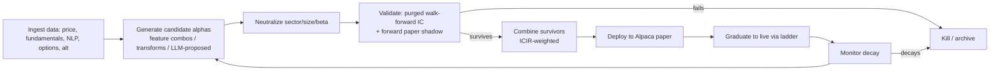

# The Path to Ungodly Returns

*Theoretical maximum, and exactly how we approach it. The honest blueprint.*

Last updated: 2026-06-05

> The point of this document is not hype. It's to map the **actual physics** of legendary
> returns, identify every lever, and sequence them. Nothing here requires magic — only
> relentless execution of things that are individually known to work.

---

## 0. What "ungodly" means — and our unfair advantage

| Fund | Net/yr | Sharpe | Why they're capped |
|------|--------|--------|--------------------|
| Renaissance Medallion | ~39% net (66% gross), 30 yrs | ~2.5+ | **Capacity** — closed at ~$10B, employees only |
| Two Sigma / DE Shaw | 10–20% | ~1–1.5 | Size: must deploy tens of $B |
| **Us (theoretical)** | **the open question** | target 1.5–3 | **Nothing — we're tiny** |

**The one advantage we have that Renaissance lost: we are small.** A $10B fund *cannot* trade a signal that only has $5M of capacity. We can. At $100k–$10M we fish in thousands of pools the giants are physically banned from by their own size. **Smallness is the edge.** Most of this plan is about exploiting it before we ever get big enough to lose it.

The ladder: **survive → 15% → 30% → 50%+ net.** Each rung is a different regime of the equation below.

---

## 1. The master equation (fully expanded)

```
Net Return  ≈   IC × √Breadth × TC × Leverage × Compounding   −   Costs − Decay
                └── skill ──┘  └edge┘  └amplify┘ └time┘            └─ the taxes on greatness ─┘
```

Five **multipliers**, two **subtractors**, one **absolute rule**:

> **Never hit zero.** Ruin is permanent. A 100% loss ends compounding forever, no matter how good the edge was. Survival is not a constraint on the strategy — it *is* the strategy.

"Ungodly" = push all five multipliers, crush both subtractors, and never risk ruin. Let's take each.

---

## 2. The five multipliers

### A. IC (skill) → the **Alpha Factory**

One model is fragile. Legendary firms run **hundreds of weak, uncorrelated alphas**. The magic: combining `n` independent signals each with IC `c` gives a blended IC up to `c·√n`, *and* cuts its volatility. More uncorrelated sleeves = higher **and** steadier skill.

The frontier of sleeves to build (in ROI order):
1. **Done:** ML edge, reversal (1d/5d), residual momentum, **PEAD**, **analyst revisions**.
2. **NLP on filings & transcripts** — sentiment, *guidance-change*, risk-factor deltas, MD&A tone from 10-K/Q/8-K and earnings calls. LLMs make this cheap now. This is a *huge* untapped edge for a small player.
3. **Options-implied** — IV skew, term-structure, put/call, unusual flow → forward-looking fear/greed per name.
4. **Short-interest / squeeze** — ORTEX cost-to-borrow, days-to-cover, utilization.
5. **Cross-asset** — credit spreads, rates, sector ETF flows as equity predictors.
6. **Quality/value** — Piotroski/Altman + cheapness (slow, diversifying, anti-correlated to momentum).
7. **Alt-data frontier** — web traffic, app-store ranks, job postings, satellite (later, paid).

**The real moat is not any sleeve — it's the factory that builds them faster than they decay** (§4).

### B. Breadth → the **free multiplier**

`IR = IC × √Breadth`. Breadth is the cheapest IR there is. Multiply it on every independent axis:

| Axis | Now | Theoretical |
|------|-----|-------------|
| Universe | ~800 | 3,000 → full liquid US (~6,000) → global ADRs |
| Horizons | 1d | +5d, +20d, +60d (PEAD/revisions live here) |
| Frequency | daily | intraday (minute bars) = 10–100× bets |
| Assets | equities | + ETFs, defined-risk options, later futures/crypto |

Each axis is independent → they **multiply**. Going from (800, 1 horizon, daily) to (3,000, 4 horizons, daily) is ~15× breadth ≈ **4× the information ratio for the same skill.**

### C. Transfer Coefficient → **keep the edge you found**

A real edge dies in implementation if you're sloppy:
- **Execution:** limit-order tactics, VWAP/TWAP slicing, minimize slippage & market impact (reinforcement-learning execution later). At our size, impact is near zero — *advantage*.
- **Neutralization:** sector / size / beta / factor-neutral so you bet on alpha, not on accidentally being "long small caps." (Already built — it flipped our spread positive.)
- **Capacity-aware sizing:** cap by ADV. Rarely binding at our size — *advantage*.

### D. Leverage → **the secret that turns 0.5% into 30%**

This is the lever people miss. A **market-neutral** book has *low volatility*, so it can be levered **safely** — you're amplifying a smooth Sharpe, not a gamble. Medallion ran large leverage on a neutral book. We already have **4× buying power** on the paper account.

> The discipline: **vol-target the book** (e.g., target 10% annualized vol) and lever to hit it. Lever the *Sharpe*, never the *bet*. A Sharpe-2 book at 2–3× leverage is how "boring" 0.5%/month edges become 30%+/yr.

### E. Compounding + Survival → **time does the heavy lifting**

- **Reinvest** everything. 30% compounded for 5 years is 3.7×; for 10 years, 13.8×.
- **Survival rules (non-negotiable):** per-name caps, gross/net limits, daily-loss kill switch, drawdown throttle (cut leverage as drawdown grows), vol targeting. Fractional-Kelly sizing — Kelly says the *maximum* bet; we run a fraction of it because variance of variance kills.
- **Tax awareness:** high-turnover neutral books are tax-inefficient; relevant only once live and sizable — note it, optimize later (longer holds where alpha allows).

---

## 3. The two subtractors (what kills the unprepared)

- **Costs:** every basis point of commission/slippage compounds against you. → Favor multi-day horizons (more capacity, less turnover), model net-of-cost, and *only deploy sleeves whose edge survives realistic friction.*
- **Alpha decay:** every edge fades as others find it. → The only durable counter is **research velocity** (build new alpha faster than old dies) + **secrecy** (never publish what works). This is *why* the factory is the moat.

---

## 4. The Autonomous Alpha Factory (the actual moat)

This is what separates a strategy from a *machine that prints strategies* — the RenTech/WorldQuant secret. And **we already have the skeleton.**



**The unlock:** we already run an evolutionary **arena**, a **scheduler/harness**, a **meta-agent (Megamind)**, a **dashboard**, and **forward gates**. Today the arena optimizes *simulated pred_ret*. **Repoint it at cross-sectional forward IC of neutralized sleeves** and it becomes a 24/7 alpha-discovery engine on your always-on machine + NPU.

**LLM-as-quant-researcher:** modern models (lots of AI + compute — which you have) can *propose* new features and read filings/transcripts at scale. The system then *tests* each proposal forward and keeps only winners. The human (you) sets direction; the machine generates and validates thousands of hypotheses. That is research velocity that no boutique can match.

---

## 5. Compute & data roadmap

| Tier | Compute | Data |
|------|---------|------|
| **Now (free)** | Local NPU inference, always-on PC | Finnhub, SEC EDGAR, FRED, GDELT, Quiver, SecuritiesDB, ORTEX, Alpaca |
| **Soon (cheap)** | Cloud GPU burst for training/NLP | Polygon/Tiingo intraday (~$30–200/mo), options chains |
| **Frontier** | Dedicated training box / yacht datacenter 🛥️ | Alt-data (web traffic, app ranks, satellite) |

LLMs do triple duty: **NLP sleeves** (filings/transcripts), **alpha idea generation**, **news-event extraction**.

---

## 6. The honest ceiling & the ladder

The equation has no hard cap on breadth, but TC, costs, decay, and eventually capacity bound the realistic outcome. For a **small, disciplined, multi-alpha, market-neutral, vol-targeted, modestly-levered** book where **forward IC holds**, the legendary band is **Sharpe 1.5–3, ~30–60% net** — *if and only if every rung is earned forward.* That's not a promise; it's the target the math permits.

**Capital ladder (gated):**

| Rung | Capital | Unlock condition |
|------|---------|------------------|
| Paper | Alpaca $100k | **NOW — live** |
| L1 | $5k live | 90d paper Sharpe ≥ 1.0, neutral, positive |
| L2 | $25k | L1 + 60d live Sharpe ≥ 0.7 |
| L3 | $100k + 1.5× lev | capacity holds, drawdown < 8% |
| L4 | scale + 2–3× lev | proven live Sharpe ≥ 1.5, vol-targeted |

---

## 7. The 12-month theoretical plan

- **Q1 — Foundation:** Alpha Factory v1 (8–10 forward-validated sleeves), breadth → 3,000 names, daily Alpaca paper neutral book (live now), vol targeting, ICIR-weighted combination + auto-decay.
- **Q2 — Intelligence:** NLP sleeves (transcripts/10-K/8-K), options-implied sleeve, **arena repointed to forward-IC alpha discovery**, leverage on paper, multi-horizon labels.
- **Q3 — Velocity & live:** intraday breadth (minute bars), execution optimization, **first live micro capital ($5k)** via ladder, decay monitoring.
- **Q4 — Scale:** lever with proven live Sharpe, add ETFs/defined-risk options, compound, reinvest.

---

## 8. What it requires from you

1. **Keep the machine on** (compute is the factory's fuel). ✔ already doing.
2. Eventually, **one cheap paid data feed** (Polygon ~$30–200/mo) for intraday breadth — only when Q3 demands it.
3. Possibly a **cloud GPU burst** budget for NLP/training — small, on demand.
4. **Patience for forward validation.** The ladder is sacred. We earn each rung.
5. Keep feeding keys/ideas. You set direction; the factory does the grind.

> Ungodly returns are not one genius trade. They are a small, relentless edge × enormous breadth × safe leverage × time, produced by a machine that invents new edges faster than the old ones die — run by someone small enough to still capture them. **That machine is what we're building.**
