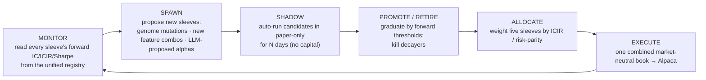

# Unified Architecture — from a museum of experiments to one fleet

*Honest architecture review + the plan to make Megamind the true brain that monitors
every system and spawns ML traders against one forward scoreboard.*

Last updated: 2026-06-05

---

## 1. The honest verdict

The individual components are strong. The architecture connecting them is not — it's a
collection of **parallel desks**, each with its own data, its own P&L, and its own UI page.

**Symptoms (measured):**

- **10–12 distinct "scoreboards"** rendered as the same green/red %: Investor backtest, Arena sim, Penny paper, Bounties paper, Alpaca paper, forward IC, alpha quintile spread, paper-agent SGD, reasoning paper, real-agent sim, predictor accuracy, healthScore.
- **Megamind optimizes a simulation.** It reads only arena v1/v2 sim ledgers + `experiment.json`; it never reads `v3_live_ic.json`, the alpha book, investor decisions, real_agents, penny, or PMP.
- **The best abstraction is siloed.** `scripts/intelligence/alpha/` (neutralized, market-neutral, forward-measured, executes on Alpaca paper) has zero imports from Megamind/arena/investor.
- **"Traders" are genomes, not models.** Arena = parameter tournament scored by `notional × pred_ret`, not realized fills.
- **Three execution roads, no roundabout:** arena→real_agents (research), investor→manifests (production), alpha→Alpaca (paper).
- **Forward truth gates model promotion but not spawning/evolution.**

**Root cause:** there is no single unifying abstraction and no single scoreboard, so the
"brain" can't reason about the whole, and capital/attention can't flow to what actually works.

---

## 2. The unifying abstraction: the **Sleeve**

> A **Sleeve** is any strategy that, each cycle, emits a cross-sectional signal (a ranked
> book / target weights) over the shared tradeable universe, plus metadata (family, horizon,
> params/genome, data deps).

Everything collapses into this one type:

| Today | Becomes |
|-------|---------|
| Investor v3 policy | a Sleeve (`policy`, horizon 1d) |
| Each Arena genome | a Sleeve (`genome`, its selection rule) |
| Alpha sleeves (ml_edge, reversal, momentum, **PEAD**, revisions) | Sleeves (already are!) |
| Penny desk | a Sleeve (sub-universe `< $5`) |
| Future NLP-on-transcripts, options-implied, short-squeeze | Sleeves |
| Bounties / PMP (events) | a **federated fund** (different asset class, same registry shape) |

Because every sleeve speaks the same language, the platform can do three things it can't today:
**measure them identically, combine them, and let Megamind allocate across them.**

---

## 3. One scoreboard, one registry, one execution layer

### 3a. One forward scoreboard
Every sleeve is scored by the **same** forward metrics (the only honest ones):
- forward rank **IC** + **ICIR** (consistency)
- **net-of-cost quintile spread** (tradeable edge)
- **paper Sharpe / return** from a shadow book
- decay flag (trailing forward IC < 0)

Backtest/sim numbers stay, clearly labeled **RESEARCH** (upper bound) — never mixed with forward.

### 3b. One Sleeve Registry (lifecycle)
Replace today's documentation-only `real_agents/registry.json` with a live registry that *drives* the system:

```
candidate ──shadow-paper N days──► shadow ──forward IC≥t, Sharpe≥t──► live_paper
   ▲                                                                      │
   └──────────────── retired ◄── decay (fwd IC<0) ◄─────────── live_capital (ladder)
```

Each entry: `id, kind, family, params, status, universe, horizon, forwardIC, icir, sharpe, weight, spawnedBy, lastEval`.

### 3c. One execution layer
Generalize `alpha/alpaca_executor.py`: take the **Megamind-weighted blend of all live sleeves**, build one market-neutral target book, enforce one risk model (gross/net caps, per-name ADV, vol target), rebalance the one account (Alpaca paper → live ladder). Gates unchanged.

---

## 4. Megamind as the fund-of-sleeves orchestrator

Today Megamind is an arena commentator. Target: the **captain** running the alpha factory loop
(WorldQuant "alpha factory" × Citadel multi-PM allocation):



**Key change:** every Megamind decision is driven by **forward truth**, not `pred_ret` sim.
Arena keeps its role as the **breeding ground** (cheap, fast genome search) — but a genome only
graduates from "arena sim winner" to "live sleeve" by **proving forward in shadow-paper**.

### What concretely changes per component
| Component | Change |
|-----------|--------|
| `ultimate_model._build_recommendations` | Read `v3_live_ic.json` + alpha_ic + per-sleeve forward eval; recommend allocation/spawn/retire on forward data, not just v1/v2 sim |
| `real_agents/registry.json` | Becomes the **live Sleeve Registry** that drives execution (not docs) |
| `arena/*` | Stays as sleeve **breeding ground**; winners auto-enrolled as `candidate` sleeves |
| `alpha/engine.py` | Becomes the **combiner** for all live sleeve signals (not just its own 6) |
| `alpha/measure.py` | Generalized to score **any** sleeve forward (per-sleeve IC/ICIR) |
| `forward_score.py` | Emits **per-sleeve** forward IC into the registry |
| `train-investor-v3` | One sleeve among many; its champion/challenger folds into the registry lifecycle |
| Penny / PMP | Registered as sleeves / federated fund with the same forward eval |

---

## 5. UX rebuild: from 8 desks → one fleet cockpit

Today the nav is a guided tour of subsystems. Target: a cockpit where the **unit is the sleeve**
and the **captain is Megamind**.

| Today (8 pages) | Target |
|-----------------|--------|
| Home (command deck) | **Bridge** — one forward scoreboard + fleet summary (total paper P&L, # live sleeves, top/bottom by forward IC, latest Megamind actions) |
| Investor Arena + Investor + Penny | **Fleet** — one table of *all* sleeves with identical forward metrics + lifecycle badge; Arena = the R&D/breeding bucket (candidate/shadow). Click → sleeve drilldown (reuse the Investor book UI) |
| Markets | **Markets** — signal source / universe browser (unchanged) |
| Megamind | **Captain's Log** — what it's monitoring, spawning, promoting, retiring; approvals; allocation weights |
| Trade | **Execution** — the *combined* live book + manifests + Alpaca status (one P&L, not per-desk) |
| Bounties | **Bounties** — event-markets fund, federated, clearly a separate asset class |
| Stack & Edge | **Stack** — how it works (architecture) |
| Chat | **Chat** — assistant with links into the above |

Result: **one** "how are we doing?" number (forward paper P&L of the combined book), with every
sleeve's contribution underneath. No more 12 conflicting percentages.

---

## 6. Migration plan (non-destructive, phased, gates intact)

**Phase 1 — One scoreboard + wire Megamind to forward truth** (highest leverage, low risk)
- Per-sleeve forward eval (extend `alpha/measure.py` + `forward_score.py`) → `data/intelligence/sleeves/registry.json`
- Megamind (`ultimate_model`) reads the registry; recommendations cite forward IC, not sim
- Dashboard: add a "Fleet" forward table (read-only)

**Phase 2 — The Sleeve Registry + adapters**
- Define the Sleeve interface; adapters wrap arena genomes, investor v3, alpha sleeves, penny as sleeves
- Lifecycle states + transitions (candidate→shadow→live) recorded in the registry

**Phase 3 — Megamind allocation + shadow-paper spawning**
- Megamind spawns candidates → auto shadow-paper for N days → promote/retire by forward thresholds
- ICIR/risk-parity allocation across live sleeves

**Phase 4 — One execution layer + UI cockpit**
- Generalize the Alpaca executor to the combined weighted book; one risk model
- Rebuild nav into Bridge / Fleet / Captain's Log / Execution

**Guardrails (unchanged):** v1/v2 frozen; never weaken readiness/live gates; sim ≠ forward; default paper/dryRun; capital only via the ladder.

---

## 7. Why this is the smart architecture

- **One truth.** Capital and attention flow to what works *forward*, automatically.
- **Compounding research velocity.** Megamind spawns + retires sleeves faster than alpha decays — the actual moat (see `docs/UNGODLY.md`).
- **The Fundamental Law, operationalized.** Many uncorrelated sleeves (breadth) × forward-proven IC × one neutral leveraged book = the equation, run by a machine.
- **A UI that tells the truth** instead of 12 numbers that don't agree.

> Today we have smart parts. This gives them a spine — and turns Megamind from a commentator
> on a simulation into the captain that actually runs the fleet.

---

## BUILT — 2026-06-06: The Crew (forward-paper agents)

First slice of the unified vision is live (`scripts/intelligence/fleet/`):

- **Agents walk forward on paper.** Each is a Robinhood-AI-agent candidate with its own
  $100k book, marked daily at real prices (forward track record accumulates).
- **Seeded crew (5):** The Navigator (`alpha_blended`, market-neutral L/S), The Quartermaster
  (`investor_v3`, long-only half-Kelly), and 3 genome pirates (Goldtooth/Sparks/Rusty-Pete) —
  top champion arena genomes promoted to forward paper.
- **Shared explainable signal frame:** `alpha/engine.build_alpha_frame()` exposes per-symbol
  neutralized sleeve z-scores + combined alpha + price; the whole crew + reasoning consume it.
- **Heavy documentation per the mandate:** every pick records the ML prediction (proba, pred_ret,
  edge), each sleeve's neutralized contribution (σ), the genome gate, the unified score
  (congress/insider/crowd), and a plain-English "why" — genome math traced back to the ML signal.
- **Persistence:** `data/fleet/agents/<id>/` → `state.json`, `equity.json`, `trades.jsonl`,
  `today.json`; fleet roll-up `data/fleet/summary.json`.
- **API:** `GET /api/fleet`, `GET /api/fleet/agent/{id}`.
- **Wired:** daily close + harness (intraday/full) step the crew forward automatically.

**Files:** `fleet/{__init__,reasoning,strategies,paper,registry,run}.py`; `alpha/engine.py` refactor.
**Hardware:** Snapdragon X (10 cores), 15.6 GB RAM, QNN NPU ×3 — engine shares one frame across
agents (RAM-lean); ready to parallelize the crew across cores as it grows.

### Next
- **Treasure Droid (captain):** rename Megamind → Treasure Droid; make it a reasoning agent that
  reads the fleet forward scoreboard, spawns new genome/sleeve agents into shadow, promotes the
  forward-proven, retires decayers, and allocates the real Alpaca book to the leaders.
- **Fleet cockpit UI:** agents list + per-agent portfolio / trade history / reasoning drilldown
  (reuse the investor book UI); collapse Arena+Investor+Penny desks into the Fleet view.
